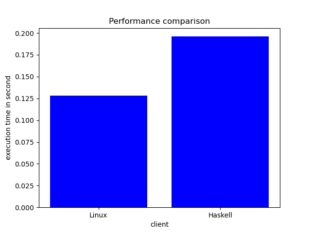

# **Benchmark Result**

We did a 500 rows and a 10000 rows SELECT query on both Linux console client and clickhouse-haskell client for the `customer` table

Here is the result

In conclusion, Clickhouse-Haskell is 50% slower than the official C++ implementation.